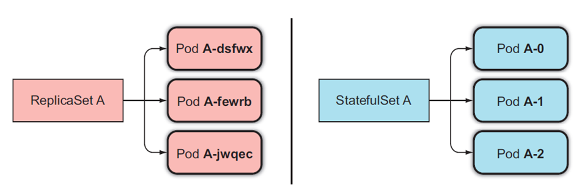
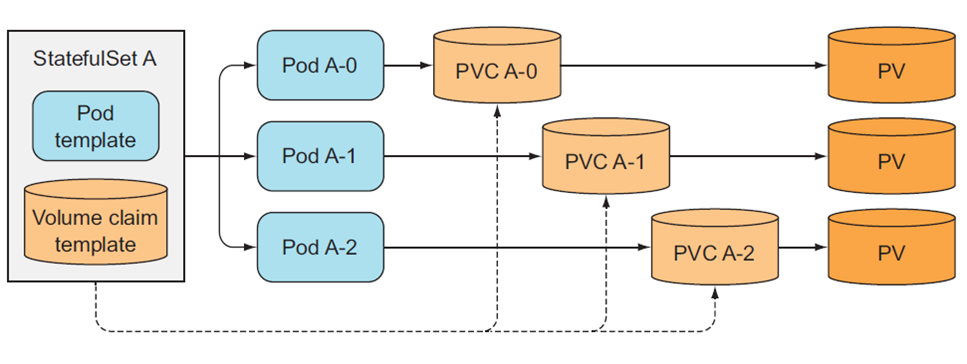
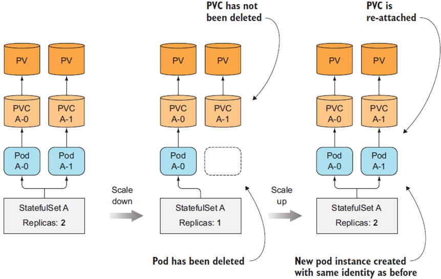

# K8s-StatefulSet Demo

### K8s - StatefulSet WorkLoad Component

- Workload API used to manage stateful Applications
- Provides guarantee about the ordering & uniqueness of the Pods that it manages
- Stable & Unique hostname, network identifier & persistent storage 
- Ordered, graceful deployment & scaling (up & down)
- Ordered and automated rolling update

### ReplicaSet V/S StatefulSet

Pod Name derived from StatefulSet’s Name & ordinal index (starting from Zero)

### StatefulSet Headless Service

- Pod specific operations may need to be performed in a StatefulSet because of which getting a unique network ID for each Pod would be the need of the hour
- Every StatefulSet is governed by a Headless service which can provide unique DNS name to directly interact with any Pod
- Headless service can be created by specifying ClusterIP:NONE and for this, K8s does not provide any ClusterIP or perform load balancing or proxy

### StatefulSet with PVC 

